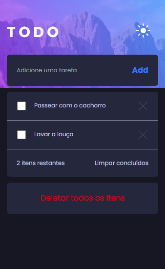

# Frontend Mentor - Todo app solution

Essa é uma solução para o [Desafio de Todo app Frontend Mentor](https://www.frontendmentor.io/challenges/todo-app-Su1_KokOW).

## Sumário

- [Visão geral](#overview)
  - [O desafio](#the-challenge)
  - [Screenshot](#screenshot)
  - [Links](#links)
  - [Tecnologias utilizadas](#built-with)
  - [What I learned](#what-i-learned)

## Overview

### O desafio

Usuários devem poder:

- Ver o layout otimizado para o app dependendo com o tamanho da tela de seus dispositivos
- See hover states for all interactive elements on the page
- Adicionar novas tarefas a lista
- Marcar tarefas como concluídas
- Deletar tarefas
- Limpar todas as tarefas concluídas
- Alternar entre modo claro e escuro

### Screenshot

### Links

- Solution URL: [Add solution URL here](https://your-solution-url.com)
- Live Site URL: [Add live site URL here](https://your-live-site-url.com)

### Built with

- React
- Typescript
- Tailwind
- CSS
- Mobile-first

### O que eu aprendi ?
Já trabalhei com typescript antes mas nunca tinha trabalhado com ele e o React juntos, esse projeto me ajudou a entender melhor tipagem de props, funções, arrays e objetos. 

Também tive meu primeiro contato com o framework Tailwind CSS nesse projeto, e posso dizer que me poupo muitas linhas de código. 

## Autor

- Website - [Add your name here](https://www.your-site.com)
- Frontend Mentor - [@yourusername](https://www.frontendmentor.io/profile/yourusername)
- Twitter - [@yourusername](https://www.twitter.com/yourusername)
